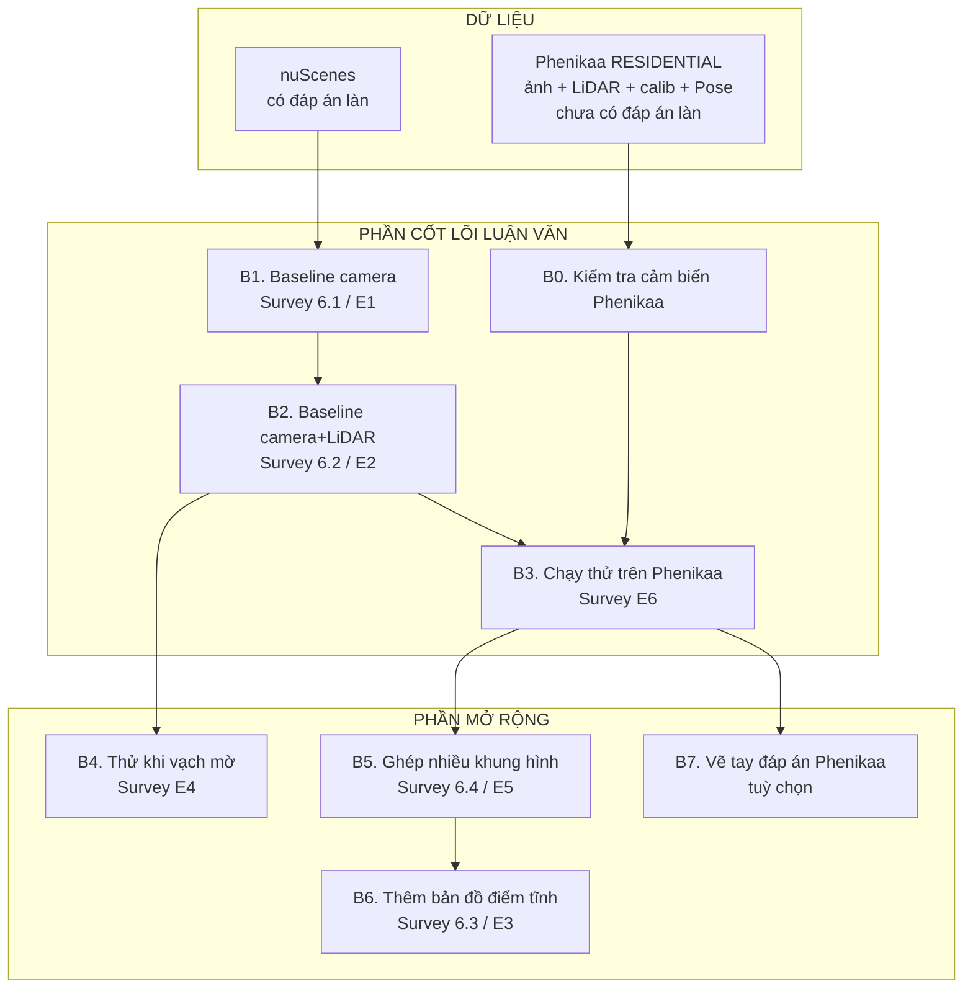
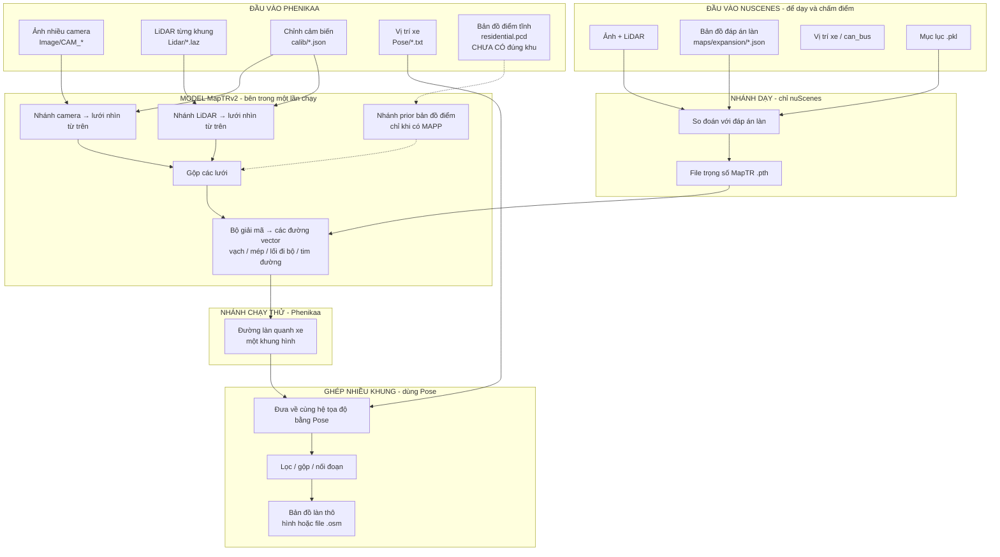
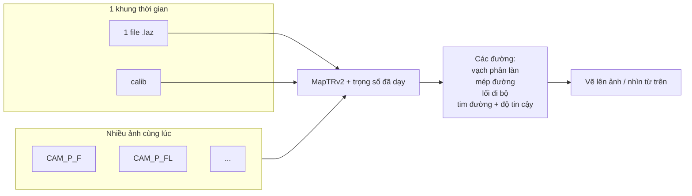
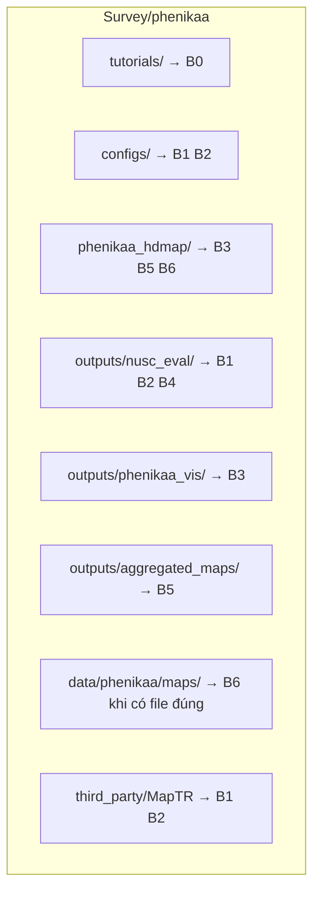

# Lộ trình từng bước + sơ đồ hệ thống

File này để **đọc và sửa**. Mỗi bước có 4 mục:

1. **Làm cái gì**  
2. **Giải quyết vấn đề gì**  
3. **Cần làm gì** (cụ thể)  
4. **Kết quả kỳ vọng**

Khái niệm nền: [HIEU_RO.md](HIEU_RO.md) · Hình mẫu: [mau/](mau/) · Checklist: [../TASKS.md](../TASKS.md)

---

## Phần 0 — Bạn đang ở đâu trong toàn bộ đề tài?

**Thứ tự bắt buộc:** B0 → B1 → B2 → B3.  
**Sau đó:** B4 / B5.  
**Khi có bản đồ điểm đúng khu:** B6.  
**Tuỳ chọn:** B7.

---

## Sơ đồ hệ thống chi tiết (toàn pipeline)

Sửa sơ đồ này khi bạn thay đổi phạm vi.

### Cách đọc sơ đồ

| Khối | Ý nghĩa |
|------|---------|
| Đầu vào Phenikaa | Cái xe/log của bạn cung cấp |
| Đầu vào nuScenes | Chỉ để **dạy** mạng và **ra số điểm** |
| Model MapTRv2 | Code opensource làm giúp; bạn **không** tự xuất file lưới nhìn từ trên bằng tay |
| Nhánh dạy | Ra file trọng số |
| Nhánh chạy thử | Đưa data Phenikaa + trọng số → đường đoán |
| Ghép nhiều khung | Dùng `Pose/`; **chưa cần** bản đồ điểm tĩnh |
| Nét đứt `MAPP` / prior | Làm sau khi có bản đồ điểm đúng khu |

---

## Sơ đồ một khung hình (nhìn gần)

---

# Lộ trình từng bước

---

## B0 — Kiểm tra chỉnh cảm biến Phenikaa

### Làm cái gì?
Xác nhận camera và LiDAR **khớp nhau**: điểm LiDAR chiếu lên ảnh đúng chỗ (đường, xe, cột…).

### Giải quyết vấn đề gì?
Nếu chỉnh cảm biến sai, mọi bước sau (lưới nhìn từ trên, đoán làn) đều lệch — coi như xây nhà trên nền nghiêng.

### Cần làm gì?
1. Dùng file sẵn: `data/phenikaa/calib/Camera_Intrinsics.json` và `Sensor_Extrinsics.json` (**không** lấy chỉnh cảm biến của nuScenes).  
2. Trong `tutorials/`: chạy `05_load_pointcloud_information.py`, rồi `11_all_things.py` (hoặc 07/08 nếu có màn hình).  
3. Mở ảnh kết quả: điểm LiDAR có nằm đúng trên đường/xe không?

### Kết quả kỳ vọng?
- Ảnh có điểm LiDAR và hộp xe **khớp** hình.  
- Yên tâm dùng `calib/` cho toàn bộ đồ án.  
- **Chưa** ra làn đường ở bước này.

**Thư mục liên quan:** `tutorials/`, `data/phenikaa/calib/`, `outputs/phenikaa_vis/tutorials/`

---

## B1 — Baseline 1: chỉ camera trên nuScenes  
*(Survey mục 6.1 / thí nghiệm E1)*

### Làm cái gì?
Dạy (hoặc chấm) MapTRv2 **chỉ dùng ảnh camera** trên bộ nuScenes — nơi đã có đáp án làn.

### Giải quyết vấn đề gì?
Có một mức nền: “chỉ nhìn camera thì đoán làn tốt đến đâu?”  
Đồng thời có **file trọng số** biết đoán làn để sau mang sang Phenikaa.

### Cần làm gì?
1. Làm việc trong `third_party/MapTR` (môi trường đã cài MapTR).  
2. Dùng mục lục `.pkl` + map expansion đã có.  
3. Train hoặc eval config camera (ví dụ mini / `maptrv2_nusc_...`).  
4. Chạy vẽ kết quả (`nusc_vis_pred` hoặc tương đương).  
5. Ghi điểm và vài hình vào `outputs/nusc_eval/e1_camera/`.

### Kết quả kỳ vọng?
- File trọng số MapTR (`.pth`) sau khi dạy camera.  
- Bảng điểm (ví dụ mAP).  
- Hình như trong `docs/mau/04_...`, `06_...`, `07_...`.

**Chưa dùng** data Phenikaa ở bước này.

---

## B2 — Baseline 2: camera + LiDAR trên nuScenes  
*(Survey mục 6.2 / thí nghiệm E2)*

### Làm cái gì?
Thêm nhánh LiDAR (tạo lưới nhìn từ trên từ đám mây điểm), gộp với nhánh camera, dạy lại trên nuScenes.

### Giải quyết vấn đề gì?
Trả lời: “thêm LiDAR có giúp mép đường / hình học tốt hơn khi camera yếu không?” — đúng hướng đề tài camera+LiDAR.

### Cần làm gì?
1. Tham khảo config fusion sẵn: `maptr_tiny_fusion_24e.py`.  
2. Làm config MapTRv2 fusion trong `configs/` (hoặc patch tối thiểu trong MapTR).  
3. Dạy trên nuScenes (có LiDAR).  
4. So điểm với B1 → ghi `outputs/nusc_eval/e2_fusion/`.

### Kết quả kỳ vọng?
- Trọng số fusion.  
- Bảng so sánh E2 vs E1 (điểm tăng/giảm theo từng loại đường).  
- Đây là baseline chính trước khi sang Phenikaa.

---

## B3 — Chạy thử trên Phenikaa RESIDENTIAL  
*(Survey thí nghiệm E6)*

### Làm cái gì?
Lấy trọng số ở B1 hoặc B2, đưa **ảnh + LiDAR + calib Phenikaa** vào cùng kiến trúc MapTR, xem đường Việt Nam ra sao.

### Giải quyết vấn đề gì?
Chứng minh hệ thống chạy được trên data thật Phenikaa (ý nghĩa thực tế), dù chưa có đáp án làn để chấm %.

### Cần làm gì?
1. Dùng mục lục `data/phenikaa/infos_residential.pkl` (đã có 200 khung).  
2. Hoàn thiện / viết cầu nối đọc ảnh `.jpg`, LiDAR `.laz`, calib JSON → đúng format model.  
3. Chạy vài khung → nhiều khung.  
4. Lưu hình vào `outputs/phenikaa_vis/`.

### Kết quả kỳ vọng?
- Video / ảnh: làn đoán trên RESIDENTIAL.  
- Báo cáo qualitative (nhìn được / lỗi chỗ nào: giao lộ, vạch mờ…).  
- **Không** bắt buộc file đáp án làn Phenikaa.  
- **Không** bắt buộc bản đồ điểm tĩnh.

---

## B4 — Thử khi vạch mờ / bị che  
*(Survey thí nghiệm E4)*

### Làm cái gì?
Trên nuScenes, **cố tình** làm ảnh kém (mờ vạch, che một phần), đo điểm tụt bao nhiêu với B1 và B2.

### Giải quyết vấn đề gì?
Khớp tên đề tài “vạch yếu / thiếu”: chứng minh (sau này có prior thì) độ bền tốt hơn; hiện tại ít nhất so được camera vs camera+LiDAR.

### Cần làm gì?
1. Viết / dùng quy trình làm hỏng giả lập trên ảnh (hoặc che vùng).  
2. Chấm lại E1 và E2.  
3. Bảng “điểm tụt”.

### Kết quả kỳ vọng?
- Biểu đồ / bảng độ tụt điểm.  
- Luận điểm: LiDAR (và sau này prior) giúp khi camera yếu.

---

## B5 — Ghép nhiều khung hình  
*(Survey mục 6.4 / thí nghiệm E5)*

### Làm cái gì?
Mỗi khung ra một đám đường quanh xe → dùng `Pose/` đưa về cùng bản đồ → lọc, gộp, nối đoạn thiếu.

### Giải quyết vấn đề gì?
Một khung chỉ thấy đoạn ngắn; ghép nhiều khung → bản đồ dài hơn, gần “lanelet / bản đồ làn” hơn.  
**Chưa cần** bản đồ điểm tĩnh.

### Cần làm gì?
1. Infer nhiều khung liên tiếp (từ B3).  
2. Nhân với ma trận trong `Pose/`.  
3. Lọc độ tin cậy thấp, gộp đoạn gần nhau, nối khoảng trống đơn giản.  
4. Xuất hình hoặc file trung gian / `.osm` thô → `outputs/aggregated_maps/`.

### Kết quả kỳ vọng?
- Một bản đồ làn thô của đoạn đường đã chạy.  
- Demo “tích lũy theo thời gian”.

---

## B6 — Thêm bản đồ điểm tĩnh (prior)  
*(Survey mục 6.3 / thí nghiệm E3) — làm sau*

### Làm cái gì?
Khi có `residential.pcd` **cùng hệ tọa độ với Pose/**: cắt vùng quanh xe → tạo thêm lưới “bản đồ cũ” → gộp vào model (có chỉnh độ tin cậy).

### Giải quyết vấn đề gì?
Bù chỗ camera/LiDAR tạm thời không thấy rõ (xe che, vạch mờ) bằng hình học ổn định của khu vực đã khảo sát.

### Cần làm gì?
1. Xin / đặt đúng file bản đồ điểm khu RESIDENTIAL.  
2. Chạy kiểm tra trùng vị trí với Pose (`scripts/verify_map_pose.py`).  
3. Viết bước cắt + tạo lưới mật độ/cao độ….  
4. Gộp vào model; so E3 vs E2 (và với E4).

### Kết quả kỳ vọng?
- Ablation: có prior vs không prior.  
- Đây là phần “đề xuất” chính trong Survey — **không chặn** B0–B5.

**Hiện tại:** `maps/*_candidate*` **không dùng** (sai khu).

---

## B7 — Vẽ tay đáp án làn Phenikaa (tuỳ chọn)

### Làm cái gì?
Annotate vài đoạn vạch/mép trên data Phenikaa để có thêm số liệu nhỏ trên VN.

### Giải quyết vấn đề gì?
Hội đồng hỏi “chỉ có hình, không có số trên data mình?” → có vài chỉ số bổ sung.

### Cần làm gì?
Chọn 20–50 khung → vẽ polyline → so với dự đoán (khoảng cách điểm, tỉ lệ khớp đơn giản).

### Kết quả kỳ vọng?
- Bảng số nhỏ trên Phenikaa.  
- **Không** thay được thí nghiệm nuScenes.

---

# Bảng tóm tắt nhanh

| Bước | Survey | Đầu vào chính | Đầu ra chính | Bắt buộc? |
|------|--------|---------------|--------------|-----------|
| B0 | nền | Phenikaa + calib | calib đã kiểm | Có |
| B1 | 6.1 E1 | nuScenes camera | trọng số + điểm | Có |
| B2 | 6.2 E2 | nuScenes cam+LiDAR | trọng số fusion + so sánh | Có |
| B3 | E6 | Phenikaa + trọng số | hình/video VN | Có |
| B4 | E4 | nuScenes đã làm hỏng | bảng độ tụt | Nên có |
| B5 | 6.4 E5 | dự đoán + Pose | bản đồ ghép | Nên có |
| B6 | 6.3 E3 | + bản đồ điểm đúng khu | prior + ablation | Khi có map |
| B7 | 8.1 | annotate tay | số nhỏ VN | Tuỳ chọn |

---

# Sơ đồ thư mục ↔ từng bước

---

# Việc làm ngay (tuần này)

1. Xong **B0** (đã có calib → chỉ cần chạy tutorials và xem hình).  
2. Bắt đầu **B1**: eval/train camera MapTRv2 trên nuScenes mini, lưu điểm + hình vào `outputs/nusc_eval/e1_camera/`.  
3. Không nhảy sang B6 (chưa có bản đồ điểm đúng khu).  
4. Không dùng `Label/` xe làm đáp án làn.

Khi sửa phạm vi đề tài: **chỉ cần sửa các sơ đồ Mermaid và bảng tóm tắt trong file này**, rồi chỉnh `TASKS.md` cho khớp.
