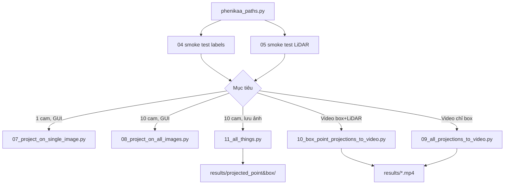

# Hướng dẫn chạy Tutorial — Box + LiDAR lên ảnh camera

Tài liệu này liệt kê **thứ tự chạy toàn bộ** script trong `tutorials/` để hiển thị **3D bounding box** và **điểm LiDAR** lên ảnh camera.

---

## 1. Chuẩn bị môi trường

```bash
cd /home/khanh247/Documents/Survey/phenikaa
conda activate phenikaa
# deps: xem ../requirements.txt (đã cài trong env phenikaa)
cd tutorials
```

**Yêu cầu:** env `phenikaa`, Python ≥ 3.10. Tutorials thuộc dự án Phenikaa (không phải upstream MapTR).
---

## 2. Cấu hình đường dẫn (bắt buộc, chỉ sửa 1 file)

Mở `phenikaa_paths.py` và chỉnh:

| Biến | Ý nghĩa | Ví dụ |
|------|---------|-------|
| `MINI_DATASET_ROOT` | Thư mục chứa các sequence | `/root/TEST_host/home/nampt/data_log/Mini Dataset` |
| `CALIB_ROOT` | Thư mục calibration | `/root/TEST_host/home/nampt/data_log/Calibration Information` |
| `SEQUENCE_NAME` | Tên folder sequence (khớp chính xác) | `COMPLEX URBAN` |

**Timestamp:** tự động quét từ `Label/*.txt` (frame đầu → frame cuối). Tutorial 1 frame dùng `TIMESTAMP` = frame đầu tiên.

```bash
# Kiểm tra nhanh sau khi sửa path
python3 -c "from phenikaa_paths import SEQUENCE_NAME, TIMESTAMPS; print(SEQUENCE_NAME, len(TIMESTAMPS), TIMESTAMPS[0], '→', TIMESTAMPS[-1])"
```

---

## 2b. Cấu hình hiển thị LiDAR (chung cho 07, 08, 10, 11)

Mở **`lidar_viz_config.py`** — mọi tutorial projection dùng chung:

| Biến | Ý nghĩa |
|------|---------|
| `LIDAR_COLOR_MODE` | `depth` \| **`depth_jet`** \| `intensity` \| `intensity_gray` \| `mono` |
| `DEPTH_JET_NORM` | `fixed` (3–60 m) \| **`visible`** (kéo giãn theo điểm trong ảnh) |
| `DEPTH_JET_METRIC` | **`z`** (trục camera) \| `range` (euclidean) |
| `LIDAR_INTENSITY_NORM` | `raw` \| `global_max` \| `global_percentile` |
| `LIDAR_DRAW_STYLE` | `circle` \| `square` \| `blend` \| `depth_blend` |
| `LIDAR_POINT_RADIUS` | Bán kính chấm (px), tham chiếu tại `LIDAR_DEPTH_REF_M` nếu `depth_blend` |
| `LIDAR_OVERLAY_ALPHA` | Độ đậm khi pha điểm lên ảnh (`blend` / `depth_blend`) |
| `CLASS_COLORS` | Màu box 3D theo class |

Chỉ sửa **một file** → chạy lại 07/08/10/11 để áp dụng.

---

## 3. Thứ tự chạy — tóm tắt nhanh

Mục tiêu **box + LiDAR trên ảnh** — chạy theo thứ tự sau:

```
Cấu hình phenikaa_paths.py
        ↓
04_load_annotations.py      ← smoke test label
05_load_pointcloud_information.py  ← smoke test LiDAR
        ↓
┌───────────────────────────────────────────────────────┐
│  CHỌN 1 TRONG CÁC LỆNH DƯỚI (theo nhu cầu)           │
├───────────────────────────────────────────────────────┤
│  07  → 1 camera, 1 frame, cửa sổ GUI                 │
│  08  → 10 camera, 1 frame, lưới 5×2 GUI              │
│  11  → 10 camera, 1 frame, lưu ảnh + BEV (khuyên dùng)│
│  10  → cả sequence, video box + LiDAR (lâu)          │
│  09  → cả sequence, video chỉ box (nhanh hơn 10)     │
└───────────────────────────────────────────────────────┘
```

---

## 4. Chi tiết từng bước

### Bước 0 — Tiền đề (tùy chọn, làm quen dataset)

| # | Script | Mô tả | Box + LiDAR trên ảnh? |
|---|--------|--------|------------------------|
| 01 | `01_load_single_image.py` | Xem 1 ảnh 1 camera | Không |
| 02 | `02_load_all_images.py` | Lưới 5×2, 10 camera, 1 frame | Không |
| 03 | `03_all_sequence_images_to_video.py` | Video ảnh gốc cả sequence | Không |
| 04 | `04_load_annotations.py` | In danh sách 3D box | Không (chỉ đọc label) |
| 05 | `05_load_pointcloud_information.py` | In thông tin file `.laz` | Không (chỉ đọc LiDAR) |
| 06 | `06_visualize_lidar_and_boxes.py` | Xem point cloud + box trong **Open3D 3D** | Không (không project lên ảnh) |

### Bước 1 — Smoke test (nên chạy trước)

```bash
python3 04_load_annotations.py
# Kỳ vọng: Loaded N valid 3D annotations (N > 0)

python3 05_load_pointcloud_information.py
# Kỳ vọng: in được số điểm LiDAR (~250k/frame)
```

Nếu `04` trả về **0 annotations** → kiểm tra lại `SEQUENCE_NAME` hoặc thiếu file `Label/{timestamp}.txt`.

---

### Bước 2 — Hiển thị Box + LiDAR trên ảnh

#### A. Một camera, một frame (GUI)

```bash
python3 07_project_on_single_image.py
```

- Camera mặc định: `CAM_P_F` (sửa biến `CAMERA` trong file nếu cần).
- Cửa sổ: trái = ảnh gốc, phải = LiDAR (màu theo khoảng cách) + box 3D.
- Đóng cửa sổ để thoát.

#### B. Mười camera, một frame (GUI)

```bash
python3 08_project_on_all_images.py
```

- Lưới 5×2 toàn bộ camera.
- Mỗi ô: LiDAR + box project lên ảnh tương ứng.

#### C. Mười camera, một frame — **lưu file** (không cần màn hình)

```bash
python3 11_all_things.py
```

**Khuyên dùng** khi chạy trên server / SSH không có display.

Kết quả trong `../results/`:

| Thư mục | Nội dung |
|---------|----------|
| `results/original_image/` | Ảnh gốc từng camera |
| `results/projected_point/` | Chỉ điểm LiDAR |
| `results/projected_box/` | Chỉ box 3D |
| `results/projected_point&box/` | **LiDAR + box** |
| `results/before_after/` | So sánh trái/phải từng camera |
| `results/bev/` | Bird's Eye View (top-down) |
| `results/grid_*.jpg` | Lưới tổng hợp 10 camera |

---

### Bước 3 — Video cả sequence (toàn bộ frame)

#### D. Video box + LiDAR — đủ 10 camera

```bash
python3 10_box_point_projections_to_video.py
```

- Dùng **toàn bộ** `TIMESTAMPS` (frame đầu → cuối).
- Output: `results/{SEQUENCE_NAME}_projected_box_point_5x2.mp4`
- **Lâu** (đọc `.laz` mỗi frame + xử lý song song).

#### E. Video chỉ box (không LiDAR)

```bash
python3 09_all_projections_to_video.py
```

- Output: `results/{SEQUENCE_NAME}_projected_3d_box_5x2.mp4`
- Nhanh hơn tutorial 10.

---

## 5. Sơ đồ luồng đầy đủ



---

## 6. Lệnh copy-paste — workflow đầy đủ

```bash
cd /path/to/phenikaa-devkit/tutorials

# 1. Sửa phenikaa_paths.py (MINI_DATASET_ROOT, CALIB_ROOT, SEQUENCE_NAME)

# 2. Kiểm tra dữ liệu
python3 04_load_annotations.py
python3 05_load_pointcloud_information.py

# 3a. Xem nhanh 1 camera (cần màn hình)
python3 07_project_on_single_image.py

# 3b. Xem 10 camera (cần màn hình)
python3 08_project_on_all_images.py

# 3c. Lưu ảnh box + LiDAR — không cần GUI
python3 11_all_things.py
ls ../results/projected_point\&box/

# 4. Video cả sequence (tùy chọn)
python3 10_box_point_projections_to_video.py
```

---

## 7. Danh sách camera

| Tên | Loại |
|-----|------|
| `CAM_P_F`, `CAM_P_FL`, `CAM_P_FR`, `CAM_P_L`, `CAM_P_R`, `CAM_P_B` | Pinhole (long-range) |
| `CAM_F_F`, `CAM_F_L`, `CAM_F_R`, `CAM_F_B` | Fisheye (blind-spot) |

Sửa camera trong tutorial 07: biến `CAMERA = "CAM_P_F"`.

---

## 8. Xử lý lỗi thường gặp

| Triệu chứng | Nguyên nhân | Cách xử lý |
|-------------|-------------|------------|
| `Loaded 0 annotations` | Sai `SEQUENCE_NAME` hoặc thiếu label | Kiểm tra folder `Label/` |
| `Sequence not found` | Tên sequence không khớp | `ls "$MINI_DATASET_ROOT"` |
| `Calibration file(s) missing` | Sai `CALIB_ROOT` | Cần `Camera_Intrinsics.json`, `Sensor_Extrinsics.json` |
| OpenCV `cameraMatrix is not a numpy array` | numpy 2.x + opencv 4.10 lệch ABI | `pip install numpy==1.26.4` + `pip install --no-deps opencv-python==4.9.0.80` |
| `could not connect to display` | Không có GUI | Dùng `11_all_things.py` thay 07/08 |

---

## 9. Bảng tra cứu nhanh — script nào cho mục tiêu gì?

| Mục tiêu | Script |
|----------|--------|
| Box + LiDAR, **1 camera**, xem trực tiếp | **07** |
| Box + LiDAR, **10 camera**, xem trực tiếp | **08** |
| Box + LiDAR, **10 camera**, **lưu ảnh** | **11** |
| Box + LiDAR, **video cả sequence** | **10** |
| Chỉ box, video cả sequence | **09** |
| Box + LiDAR trong không gian 3D (không ảnh) | **06** |
